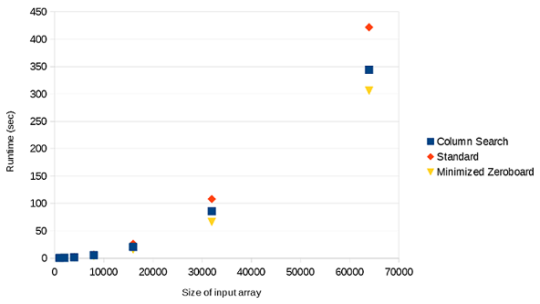

# Fast Three-Sum

Three approaches to solving the 3-sum problem:
* Column-Search
* Minimized Zeroboard
* Standard solution with two pointers

### Runtime Results
While both of the alternative approaches are faster than the standard algorithm, the minimized zeroboard approach is clearly superior to both of these due to the slower runtime growth rate.
The runtime is quadratic but it's faster than the standard approach due to the minimization of the amount of quadratic work that needs to be done to find triplets summing to zero.
 

&copy; Chris Burgoyne 2022